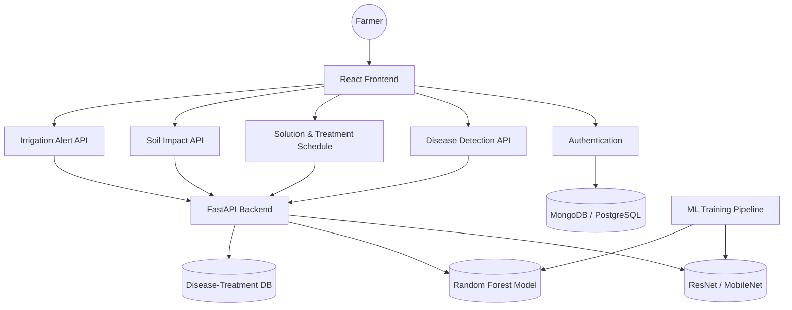

# Smart Crop Doctor - System Architecture & Setup Guide

## 1. Full Project Architecture

The **Smart Crop Doctor** consists of three main components: a modern React frontend for the user interface, a Python FastAPI backend for serving APIs, and an ML pipeline for training and serializing deep learning and scikit-learn models.

### Architecture Diagram



### Module Breakdown

1. **Frontend (React/Vite)**
   - Dashboard: Overview of crop health and notifications.
   - Diagnosis Page: Upload crop image for detection.
   - Treatment Timeline: Dynamic calendar-like view showing treatment schedules.
   - Soil & Water Analytics: Charts and predictors for soil health (NPK) and watering.
2. **Backend (FastAPI)**
   - `/predict-disease`: Processes image data, runs MobileNet inference, returns prediction & confidence.
   - `/get-treatment`: Looks up treatments and fertilizers based on disease.
   - `/schedule`: Generates day-by-day JSON schedules for crop recovery.
   - `/soil-analysis`: Takes fertilizer and soil info, runs tree-based model to predict impact.
   - `/irrigation`: Simple rules or model predicting needed water based on crop type and moisture.
3. **ML Directory**
   - Script to load `PlantVillage` data and train a CNN.
   - Script to train a simple Random Forest for soil analytics.
4. **Database**
   - Used to store static lookup files or real DB for users and crop history. In this build, we use a lightweight JSON/SQLite approach for portability, which easily scales to PostgreSQL or MongoDB via SQLAlchemy/MongoEngine.

## 2. Directory Structure

```
Smart-Crop-Doctor/
├── frontend/                  # React Application
├── backend/                   # FastAPI Server
│   ├── main.py                # Server entrypoint
│   ├── models/                # Saved ML models (.h5, .pkl)
│   ├── database/              # DB schemas and handlers
│   └── routers/               # API endpoint modules
└── ml_pipeline/               # Training codebase
    ├── train_disease_cnn.py
    └── train_soil_model.py
```

## 3. Step-by-Step Setup Guide

### Prerequisites
- Node.js (v18+)
- Python (v3.9+)

### Frontend Setup
1. Navigate to the frontend directory: `cd frontend`
2. Install dependencies: `npm install`
3. Start the dev server: `npm run dev`

### Backend Setup
1. Navigate to the backend directory: `cd backend`
2. Create virtual environment: `python -m venv venv`
3. Activate environment:
   - Windows: `venv\Scripts\activate`
   - Mac/Linux: `source venv/bin/activate`
4. Install dependencies: `pip install -r requirements.txt`
5. Start FastAPI server: `uvicorn main:app --reload`

### ML Training Pipeline
1. Add raw datasets into `ml_pipeline/data/`
2. Run `python ml_pipeline/train_disease_cnn.py` to generate the `.h5` file.
3. Move generated `.h5` and `.pkl` models to `backend/models/` for API inference.

## 4. Deployment Strategy
- **Frontend**: Vercel/Netlify. Connect directly to standard GitHub repository.
- **Backend**: Render or Railway. Use a Dockerfile or standard Python web server config.
- **Database**: MongoDB Atlas for user data and treatments.
